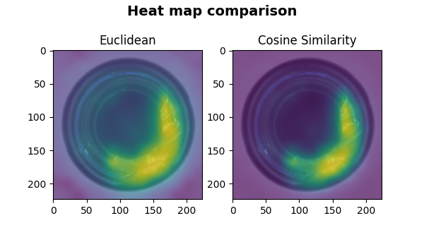

# PatchCore Transformed 
[A Vision Transformer Approach To Anomaly Detection](https://amslaurea.unibo.it/id/eprint/31435/)
> ** N.B.: This repository is still under development **

This project was part of my master's thesis. It focused on integrating ViTs into [PatchCore](https://arxiv.org/abs/2106.08265) as an alternative to traditional CNNs.

### Models:
- PatchCore = Abstract Class
- VanillaPatchCore = PatchCore + CNN Backbone
- PatchCoreViT = PatchCore + ViT Backbone ( + Layer Concatenation) 
- PatchCoreSWin = PatchCore + SWin Backbone ( + Layer Concatenation) 

# Patchcore
PatchCore is an anomaly detection methos for images that leverages feature embeddings from pre-trained convolutional neural networks:
1. Extracting patch-level features from images using a backbone network.
2. Constructing a memory bank of representative features from normal (non-anomalous) images.
3. Detecting anomalies by measuring the distance between features of a test image's patches and the nearest neighbors in the memory bank.
4. Aggregating patch-level anomaly scores to prodice an image-level anomaly score.

## Visual representation of PatchCore's Algorithm

*The f_coreset parameter was set to 1 to prevent discarding any patches from the memory bank, ensuring that the original image associated with the target patch could still be retrieved.*

*With a ViT backbone, an interesting property can be observed: the target patch often matches patches from the same spatial region in other images, thanks to the positional encodings.*

*For instance, a white patch in the bottom-right corner of an image is more likely to match a white patch in the bottom-right corner of another image in the memory bank, rather than a white patch in a different location such as the bottom-left.*

## Heatmap comparison

*The choice of distance affects the appeareance of PatchCore heatmaps.
Cosine similarity is bounded between 0 and 1, producing a well-defined heatmap with clear constrast, making anomalous regions easier to identify.
Euclidean distance, in contrast, is unbounded, resulting in a more spread-out range of values and a less distinct heatmap, where anomalies are visually less prominent.*

# patchcore_models.py

## MvTecDataset Class
This custom class was tailored to fit the directory topography of the [MvTec AD dataset](https://www.mvtec.com/company/research/datasets/mvtec-ad/downloads).

> ### MvTec Directory Topography:
> (*Ex. with 'bottle' class*)
> - / bottle
>   - / train 
>       - / good / *.png
>   - / test
>       - / good / *.png
>       - / broken_large / *.png
>       - ...
>       - / contamination / *.png
>   - / ground_truth / 
>       - / broken_large / *_mask.png
>       -  ...
>       - / contamination / *_mask.png

> ### Attributes:
> - `filepaths`: List containing the absolute path of the images.
> - `target`: List containing the ok and not ok (nok).
> - `transform`: The Image transformation that needs to be applied. 
---
## PatchCore Class
>### Attributes:
> - `device`
> - `backbone`
> - `model`
> - `processor`
> - `layers`
> - `seed`
> - `memory_bank`
> - `f_coreset`
> - `eps_coreset`
> - `k_nearest`
> - `image_size`

### Methods:
> #### __init__ (f_coreset, eps_coreset, k_nearest, vanilla, backbone, image_size):
>- Parameter initialization, it also prepares the GPU.
>- hook saves the output in *self.features*.
>- Uses *register_forward_hook* method to associate a layer with a hook function.

>#### forward (sample: tensor):
>- Returns *self.features*, which is the output from the layers to which the hook was attached.
>- Passes the input through the backbone (*self.model*).

>#### extract_embeddings (sample):
>- Returns a `patch`.
>- Returns `feature_maps` (for debugging purposes).
>- Uses *forward* method to obtain the feature maps.
>- Feature maps will be processed and transformed based on the type of backbone (*self.model*).

>#### predict (sample, metric):
>- Returns the `anomaly score` and the `anomaly map`. 
>- Uses *extract_emdeddings* method.

>#### fit (train_paths,  scale: int=1):
>- Populates the `memory bank` (*self.memory_bank*).
>- Network training, inside it *extract_embeddings* is called.
>- Coreset subsampling prunes the memory bank by keeping the most significant patches.

>#### evaluate (test_val_paths, metric, validation_flag = True):
>- Computes the ROCAUC at image and pixel levels.
>- Computes the `precision`, `recall` and `F1 score`.
>- The threshold for the F1 score was determined via *dynamic thresholding*. This approach involves testing different threshold values and selecting the one that produces the highest F1-score on the validation set.

---
# patchcore_utils.py
The module contains utility functions for:
1. Image and patch visual analysis.
2. Model evaluation on the entire MVTec dataset. 

>### Attributes:
> - `mvtec_classes` = [ "bottle", "cable", ..., "zipper" ]
> - `img_size` = (224, 224)
> - `red_color` = (0, 0, 255)
> - `thickness` = 1
> - `n_patch_img` = 196
> - `n_patch_side` = 14
> - `w_patch` = 16px
> - `h_patch` = 16x

### Visual Analysis Methods:

> #### get_box_coordinates (idx):
>- Returns the top left and bottom right image coordinates of the patch given its index.

> #### get_plot_images (idx, path):
>- Returns the image with the specified patch highlighted, along with the cropped version of that patch.
>- Uses the *get_box_coordinates* method to draw the highlighed patch.

> #### show (input_idx, input_path, model, distance_label, save, alpha):
>- Plots the closest associated patch in the `memory bank` for a GIVEN patch index.
>- Uses the *get_plot_images* method to create the images inside the plot.

> #### create_gif (input_path, model, metric, duration, output_path):
>- Creates a gif that shows, FOR EACH patch index of the input image, the closest associated patch in the `memory bank`.

### Evaluation Methods:

> #### get_result (model_constructor, model_params, class_name, base_path):
>- Returns a dictionary (`result`) containing the result for ONE SPECIFIC class of the MVTec Dataset.
>- The `result` dictionary includes the ROCAUC score at both pixel and image level, as well as `precision`, `recall` and `F1 score`.

> #### get_results (model_constructor, model_params):
>- Returns a dictionary (`results`) containing the results for ALL classes of the MTec dataset.
>- Uses the *get_result* method to retrieve the `result` of a single class of the MVTec Dataset.
>- It also computes the average ROCAUC score at both pixel and image level.

> #### print_results (results):
>- Prints the `results` dictionary into an easily readable format.

> #### save_json (results, json_name):
>- Converts the dictionary `results` into a JSON file that can be stored.